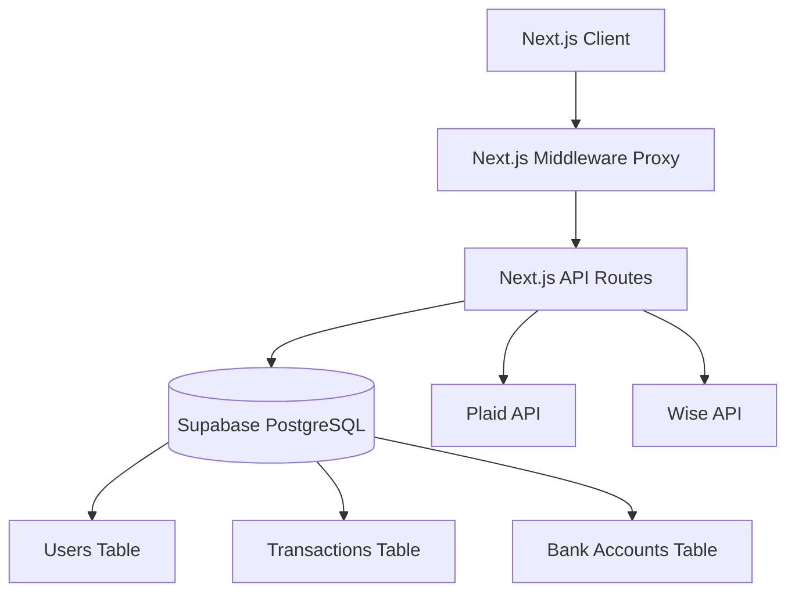

# Manna App – System Architecture

## High Level Architecture

## Frontend Architecture
- **Framework:** Next.js 16 (App Router) with React 19
- **Styling:** Tailwind CSS 4
- **State Management:** React hooks (`useState`, `useEffect`)
- **Routing:** App Router with route groups `(app)` and `(auth)`

## Backend Architecture
- **Framework:** Next.js API Routes
- **Database Access:** Direct SQL queries using `postgres.js` (no ORM)
- **Authentication:** Custom JWT implementation via cookies

## Authentication Flow
1. User submits credentials to `/api/auth/login` or `/api/auth/register`
2. Backend validates, hashes password with `bcryptjs`
3. Backend generates JWT via `jsonwebtoken` and sets `manna-token` HTTP-only cookie
4. `proxy.ts` middleware intercepts requests, verifying the JWT cookie to protect `(app)` routes and redirect authenticated users away from `(auth)` routes

## Authorization Model
- Route-level protection via middleware
- API-level protection via `getAuthUser()`
- Resource-level authorization (e.g., checking `sender_id` on transaction PATCH)
