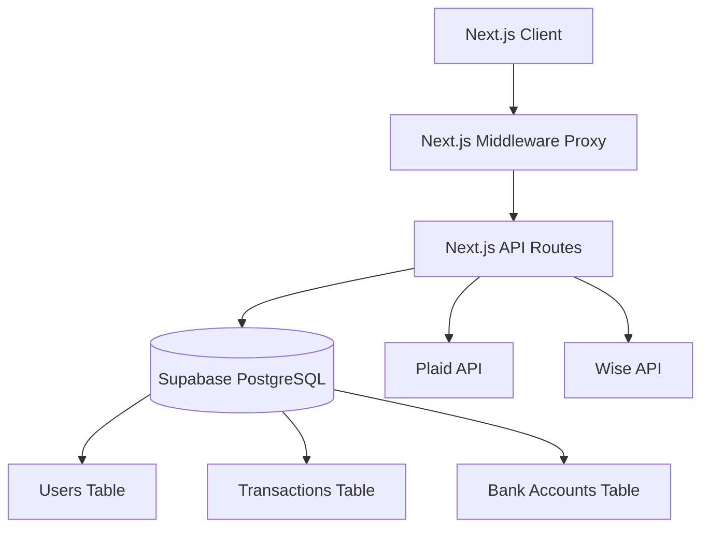

# Manna App – Technical Hoffoff Document

## Executive Summary

**Purpose:** Manna is a peer-to-peer payment application designed for cross-border money transfers between the United States and Canada. It allows users to send and request money, manage dual-currency balances, and link bank accounts.

**Primary Users:** Individuals in the US and Canada who need to send money domestically or cross-border to friends and family.

**Core Business Requirements:**
- Dual-currency wallet system (CAD and USD)
- Real-time cross-border FX quoting via Wise
- Bank account linking via Plaid
- Social feed of transactions and friend management
- Strict velocity limits based on KYC status

**Current Project Status:** The application is deployed to production on Vercel. Core user registration, dual-currency balances, FX quoting, sending money, and Plaid token exchange are implemented. However, there are significant unfinished UI surfaces (e.g., KYC flow, add/withdraw money) and some technical debt regarding the legacy single-currency balance field.

---

## System Architecture

### High Level Architecture



### Frontend Architecture
- **Framework:** Next.js 16 (App Router) with React 19
- **Styling:** Tailwind CSS 4
- **State Management:** React hooks (`useState`, `useEffect`)
- **Routing:** App Router with route groups `(app)` and `(auth)`

### Backend Architecture
- **Framework:** Next.js API Routes
- **Database Access:** Direct SQL queries using `postgres.js` (no ORM)
- **Authentication:** Custom JWT implementation via cookies

### Database Architecture
- **Provider:** Supabase PostgreSQL
- **Connection:** Transaction/session pooler configured in `lib/db.ts`
- **Schema Management:** Ad-hoc via `initializeSchema()` and `/api/migrate` endpoint

### Third Party Integrations
- **Plaid:** Used for bank account linking (`react-plaid-link` on frontend, `plaid` Node SDK on backend)
- **Wise:** Used for live FX rates via direct REST API calls
- **Supabase:** Managed PostgreSQL database

### Authentication Flow
1. User submits credentials to `/api/auth/login` or `/api/auth/register`
2. Backend validates, hashes password with `bcryptjs`
3. Backend generates JWT via `jsonwebtoken` and sets `manna-token` HTTP-only cookie
4. `proxy.ts` middleware intercepts requests, verifying the JWT cookie to protect `(app)` routes and redirect authenticated users away from `(auth)` routes

### Authorization Model
- Route-level protection via middleware
- API-level protection via `getAuthUser()`
- Resource-level authorization (e.g., checking `sender_id` on transaction PATCH)

---

## Technology Stack

- **Language:** TypeScript 5
- **Framework:** Next.js 16.2.6, React 19.2.4
- **Database Driver:** `postgres` 3.4.9
- **Auth:** `jsonwebtoken`, `bcryptjs`
- **Integrations:** `plaid`, `react-plaid-link`
- **Styling:** Tailwind CSS 4
- **Hosting:** Vercel
- **Database Hosting:** Supabase

---

## Repository Structure

```text
/
├── app/
│   ├── (app)/          # Authenticated routes (feed, profile, send, request, history, friends)
│   ├── (auth)/         # Public routes (login, register)
│   ├── api/            # Backend API routes
│   ├── globals.css     # Global Tailwind styles
│   ├── layout.tsx      # Root layout
│   └── page.tsx        # Root redirector
├── lib/
│   ├── auth.ts         # JWT, velocity limits, audit logging
│   ├── db.ts           # Postgres connection and schema init
│   ├── fx.ts           # Wise API integration and FX logic
│   └── plaid.ts        # Plaid client configuration
├── public/             # Static assets
├── proxy.ts            # Auth middleware
├── next.config.ts      # Next.js config (serverExternalPackages)
├── package.json        # Dependencies
└── tailwind.config.ts  # Tailwind configuration
```

### Major Files
- `app/api/transactions/route.ts`: Core money movement logic, FX quote generation, and balance updates.
- `lib/auth.ts`: Contains critical business logic for velocity limits based on KYC status.
- `lib/db.ts`: Database connection pooler and schema definitions.
- `proxy.ts`: Next.js middleware enforcing authentication rules.

---

## Database Documentation

### Schema Overview
The database uses a single schema with direct SQL queries.

### Tables
- `users`: Core identity, dual balances (`balance_cad`, `balance_usd`), legacy `balance`, `kyc_status`, auth fields.
- `transactions`: Records all money movement, including FX details (`fx_rate`, `fx_fee`, `sender_currency`, `receiver_currency`, `is_cross_border`).
- `bank_accounts`: Linked external accounts via Plaid.
- `friends`: Social graph relationships.
- `velocity_checks`: Tracks transaction volume against limits.
- `audit_logs`: System audit trail.

### Migration History
Migrations are currently ad-hoc. The initial schema is defined in `initializeSchema()` in `lib/db.ts`. Recent schema updates (adding `balance_cad`, `balance_usd`, `bank_accounts` columns) were applied via the `/api/migrate` endpoint using `ALTER TABLE ... ADD COLUMN IF NOT EXISTS`.

---

## API Documentation

### Core Endpoints

**POST `/api/transactions`**
- **Purpose:** Send or request money.
- **Request:** `{ receiverUsername, amount, note, type: 'pay'|'request', privacy }`
- **Response:** `{ success: true, transactionId, isCrossBorder, receiverAmount, receiverCurrency }`

**PATCH `/api/transactions/[id]`**
- **Purpose:** Accept or decline a pending request.
- **Request:** `{ action: 'accept'|'decline' }`

**POST `/api/fx/quote`**
- **Purpose:** Get a live FX quote before sending cross-border.
- **Request:** `{ amount, fromCurrency, toCurrency }`
- **Response:** `FxQuote` object

**POST `/api/plaid/exchange-token`**
- **Purpose:** Exchange Plaid Link public token for access token.
- **Request:** `{ public_token, metadata }`

---

## Environment Configuration

### Required Environment Variables
These must be configured in the Vercel dashboard:
- `DATABASE_URL`: Supabase PostgreSQL connection string (Transaction pooler URL)
- `JWT_SECRET`: Secret key for signing auth cookies
- `PLAID_CLIENT_ID`: Plaid API Client ID
- `PLAID_SECRET`: Plaid API Secret (Production)
- `NEXT_PUBLIC_PLAID_ENV`: Must be set to `production`
- `WISE_API_KEY`: Wise API token
- `WISE_ENV`: Set to `production`

### Local Development Setup
1. Clone repository
2. `npm install`
3. Create `.env.local` with the variables above
4. `npm run dev`

---

## Completed Features

### Registration & Login
- **Purpose:** User onboarding and authentication.
- **Implementation:** Custom JWT cookies, bcrypt hashing, account lockout after 5 failed attempts. Seeds new users with $100 in their local currency.
- **Files:** `app/api/auth/register/route.ts`, `app/api/auth/login/route.ts`, `lib/auth.ts`

### Send Money & FX Quotes
- **Purpose:** Core P2P transfer functionality.
- **Implementation:** Checks velocity limits, calculates cross-border FX via Wise API, deducts from correct currency balance, records transaction.
- **Files:** `app/api/transactions/route.ts`, `lib/fx.ts`, `app/(app)/send/page.tsx`

### Plaid Bank Linking
- **Purpose:** Connect external funding sources.
- **Implementation:** Generates link token, exchanges public token, saves account metadata to `bank_accounts`.
- **Files:** `app/api/plaid/create-link-token/route.ts`, `app/api/plaid/exchange-token/route.ts`

---

## In Progress / Unfinished Features

### KYC & Identity Verification
- **State:** UI shows a "Start verification" button on the profile page, but it has no click handler. Backend velocity limits depend on `kyc_status` ('pending' vs 'verified').
- **Next Steps:** Implement a KYC provider integration (e.g., Stripe Identity or Persona) and an endpoint to update `kyc_status`.

### Add Money / Cash Out
- **State:** Profile page shows buttons for "+ Add Money" and "Cash Out", but they are inert.
- **Next Steps:** Implement Plaid Transfer or Stripe ACH integration to move funds between the Manna wallet and linked `bank_accounts`.

### Friend Requests
- **State:** Users can add friends, which immediately sets status to `accepted`. There is no inbox for pending friend requests.
- **Next Steps:** Update `/api/friends` to create `pending` requests and build a UI to accept/decline them.

---

## Known Bugs

### Request Money Acceptance Uses Legacy Balance
- **Description:** When a user accepts a pending money request, the backend deducts from the legacy `balance` field instead of `balance_cad` or `balance_usd`, and ignores cross-border FX logic.
- **Root Cause:** `/api/transactions/[id]/route.ts` was not updated during the dual-currency migration.
- **Files:** `app/api/transactions/[id]/route.ts`
- **Recommended Fix:** Rewrite the `accept` branch to mirror the logic in `POST /api/transactions` for `type = 'pay'`, including FX quotes and correct currency deduction.

---

## Technical Debt

### Architecture Concerns
- **Database Migrations:** The project lacks a formal migration system (e.g., Prisma, Drizzle, or raw SQL migration files). Schema changes are currently made by appending `ALTER TABLE` statements to the `/api/migrate` route.
- **Security:** Plaid access tokens are stored in plaintext in the `plaid_access_token_enc` column. They should be encrypted at rest using a KMS or application-level encryption.

### Refactoring Opportunities
- **Legacy Balance Field:** The `balance` column in the `users` table should be dropped entirely. All logic should use `balance_cad` and `balance_usd`.

---

## Testing
- **Current Status:** No automated tests exist in the repository.
- **Recommended Strategy:**
  - Implement Jest + React Testing Library for frontend components.
  - Implement Playwright or Cypress for E2E flows (especially the Send Money flow).
  - Add integration tests for the `transactions` API route to verify balance math and velocity limits.

---

## Deployment
- **Architecture:** Deployed on Vercel (Serverless Functions for API routes, Edge Middleware for `proxy.ts`).
- **Build Process:** Standard `next build` triggered automatically by Vercel on push to `main`.
- **Database:** Supabase PostgreSQL.

---

## Development Roadmap

### Immediate Priorities
1. Fix the Request Money acceptance bug (`/api/transactions/[id]/route.ts`).
2. Remove the legacy `balance` column and update all queries.
3. Encrypt Plaid access tokens at rest.

### Short Term Roadmap
1. Implement the "Add Money" and "Cash Out" flows using linked bank accounts.
2. Implement the KYC verification flow.

### Long Term Roadmap
1. Introduce a formal database migration tool.
2. Add comprehensive automated testing.
